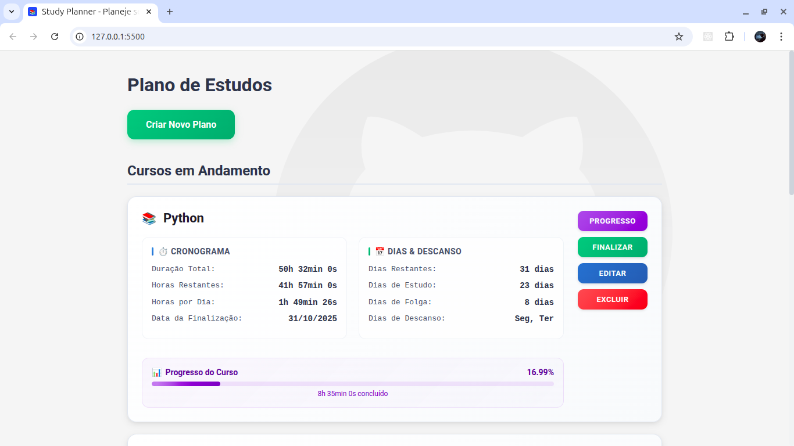

# Study Planner

Uma aplicação web para organização e planejamento de estudos, desenvolvida com HTML, CSS e JavaScript puro.

## 📸 Preview



## 📋 Descrição

O Study Planner é uma ferramenta para auxiliar estudantes a organizarem seus cursos e planos de estudo de forma eficiente. A aplicação permite criar, editar e gerenciar diferentes cursos, com acompanhamento de progresso e organização visual.

## ✨ Funcionalidades

- **Gerenciamento de Cursos**:
  - Criar novos cursos com título, duração(em horas), data de conclusão e dias de descanso
  - Editar informações de cursos existentes
  - Excluir cursos indesejados
  - Visualizar detalhes completos de cada curso

- **Acompanhamento de Progresso**:
  - Planejamento automático de horas de estudo diárias
  - Visualizar percentual de conclusão de cada curso

## 🚀 Tecnologias Utilizadas

- **HTML5** - Estrutura semântica
- **CSS3** - Estilização moderna com Flexbox e Grid
- **JavaScript** - Vanilla JS com módulos ES6
- **LocalStorage API** - Persistência de dados no navegador
- **Componentes Modulares** - Organização em módulos independentes

## 🏗️ Estrutura do Projeto

```
study-planner/
├── assets/
│   ├── favicon.svg             # Favicon do site
│   ├── github-background.svg   # Background decorativo
│   └── loading.gif             # Animação de carregamento
├── css/
│   ├── base.css                # Reset e estilos base
│   ├── main.css                # Estilos principais
│   └── components/
│       ├── modals.css          # Estilos para modais
│       └── notifications.css   # Estilos para notificações
├── js/
│   ├── app.js                  # Inicialização da aplicação
│   ├── config.js               # Configurações globais
│   └── modules/
│       ├── courseCalculations.js # Cálculos de progresso
│       ├── modals.js             # Gerenciamento de modais
│       ├── notifications.js      # Sistema de notificações
│       ├── storage.js            # Persistência de dados
│       └── validations.js        # Validação de formulários
├── index.html                  # Página principal
└── README.md                   # Documentação
```

## 👨‍💻 Autor

**Matheus** - [matheusfd3](https://github.com/matheusfd3)